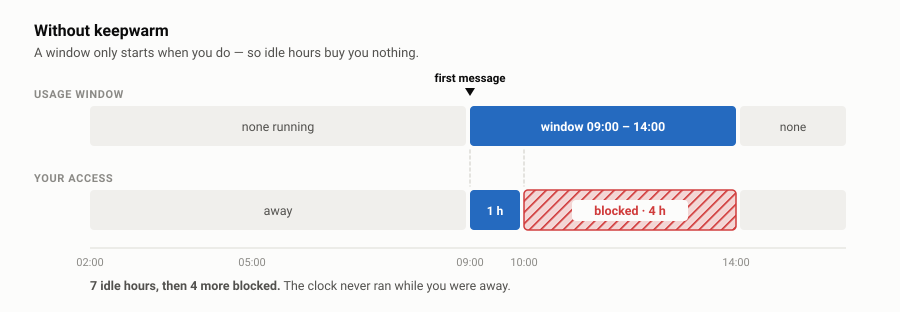
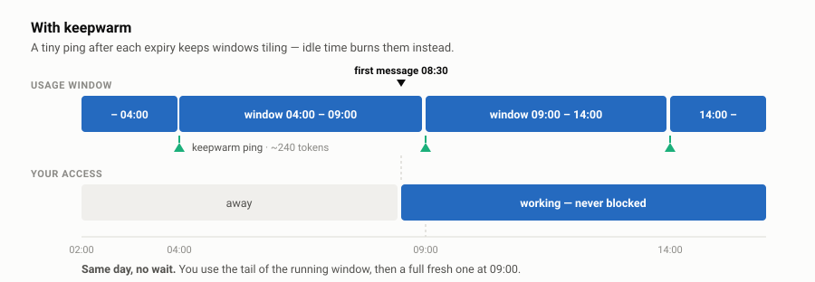

---
hide:
  - navigation
---

<div class="kw-hero" markdown>

# Stop waiting out your 5-hour window

<p class="kw-tagline">
Claude Code's usage window only starts when <em>you</em> do. Idle all night, and
those hours buy you nothing. <strong>keepwarm</strong> keeps windows rolling
around the clock, using a few hundred tokens from the subscription you already
pay for.
</p>

<div class="kw-cta" markdown>
[Install it](install.md){ .md-button .md-button--primary }
[How it works](how-it-works.md){ .md-button }
</div>

</div>

## The problem

Your window starts at the **top of the hour containing your first message** and
lasts five hours. It does not tick while you're away.

<figure class="kw-figure" markdown>

<figcaption>You were away for seven hours and still had to wait four more.</figcaption>
</figure>

The hours you spent asleep were never converted into anything. The window only
began when you sat down — and then you burned it in an hour and sat blocked for
the rest.

## The fix

keepwarm sends one tiny prompt just after each window expires, so windows tile
back to back whether you're at the keyboard or not.

<figure class="kw-figure" markdown>

<figcaption>Idle time now burns windows, so your working time doesn't have to.</figcaption>
</figure>

You do **not** get more quota per window. You get **more windows per day** — up
to the plan's natural ceiling of 24 ÷ 5 ≈ 4.8 — regardless of when you sit down.

<div class="kw-stats" markdown>

<div class="kw-stat" markdown>
<span class="kw-num">~240</span>
<span class="kw-lab">tokens per ping, measured</span>
</div>

<div class="kw-stat" markdown>
<span class="kw-num">$0 extra</span>
<span class="kw-lab">uses your existing subscription</span>
</div>

<div class="kw-stat" markdown>
<span class="kw-num">~1,200</span>
<span class="kw-lab">tokens a day, all in</span>
</div>

<div class="kw-stat" markdown>
<span class="kw-num">3 OSes</span>
<span class="kw-lab">macOS, Linux, Windows</span>
</div>

</div>

## Quickstart

=== "macOS / Linux"

    ```sh
    git clone https://github.com/mamuncseru/claude-keepwarm.git
    cd claude-keepwarm

    ./keepwarm install   # hourly cron job
    ./keepwarm ping      # open the first window
    ./keepwarm doctor    # confirm it's running
    ```

=== "Windows"

    ```powershell
    git clone https://github.com/mamuncseru/claude-keepwarm.git
    cd claude-keepwarm

    .\keepwarm.ps1 install   # hourly scheduled task
    .\keepwarm.ps1 ping      # open the first window
    .\keepwarm.ps1 doctor    # confirm it's running
    ```

Needs a logged-in [Claude Code](https://claude.com/claude-code) CLI. Full notes
on the [Install](install.md) page.

## Is it running?

You never have to wait for a ping to find out. Every hourly tick writes a log
line even when nothing is due, so the log doubles as a heartbeat.

<div class="kw-term" markdown>

```
$ ./keepwarm doctor

  [ok]   claude binary          /home/you/.local/bin/claude
  [ok]   cron job               installed (fires at :02 every hour)
  [ok]   cron daemon            running
  [ok]   last tick              0h 08m ago — cron is firing
  [ok]   window tracked         2026-08-02 13:00 -> 2026-08-02 18:00

  next cron tick   2026-08-02 17:02 (in 0h 47m)
  that tick will   log a WAIT line and exit (no API call)
  first ping tick  2026-08-02 18:02 (in 1h 47m)

  5 ok, 0 warning(s), 0 failing
```

</div>

`doctor` exits non-zero when something is wrong, so it works as a health probe
too.

## Honest notes

!!! success "No extra charge - it uses the subscription you already have"

    Pings consume a tiny slice of the usage your plan already includes. There is
    **no separate bill and nothing to enable** - the same allowance your normal
    Claude Code sessions draw on. Any dollar figure on this site is the
    equivalent API value, shown purely for scale.

    The one exception: if you've pointed Claude Code at an `ANTHROPIC_API_KEY` or
    enabled pay-as-you-go extra usage, those tokens are billed the usual way -
    around a third of a cent a day.

!!! note "It doesn't raise your limits"

    keepwarm uses your own subscription within your plan's existing limits. It
    doesn't increase them, bypass them, or share credentials, and it reads no
    secrets — authentication is whatever the Claude Code CLI already has. It
    does generate automated background usage on your account, so make sure
    that's consistent with your plan's terms.

!!! warning "Boundaries rotate"

    24 isn't divisible by 5. Boundaries at 07:00 / 12:00 / 17:00 / 22:00 today
    become 03:00 / 08:00 / 13:00 / 18:00 / 23:00 tomorrow. That's inherent to a
    five-hour window — see [How it works](how-it-works.md#boundaries-rotate).

An unofficial community tool, not affiliated with Anthropic. MIT licensed.
